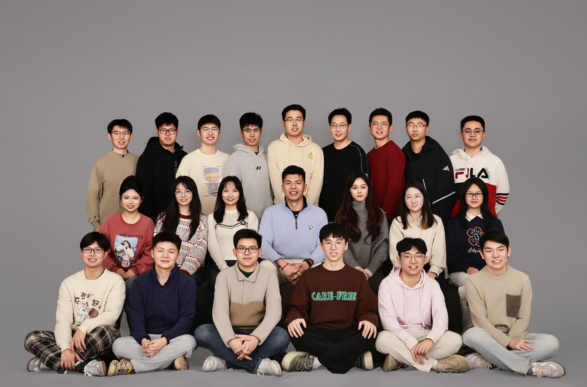

BDAL-RUC团队成员集体照
======

BDAL-RUC简介
======
Hi大家好，我是孟澄，现在是中国人民大学（RUC）统计与大数据研究院的一名准聘助理教授、博士生导师，主要研究方向是大数据统计学、最优输运问题、人工智能、工业统计等等。

我于2015年从清华大学数学系本科毕业，2020年从美国佐治亚大学毕业获得统计学博士学位，我的博士导师是一对超棒的学术夫妻，是Big Data Analytics Lab（BDAL）的实验室主任马平教授和钟文瑄教授。入职人大之后，我非常有幸遇见了一群超棒的同学们，共同组建了BDAL-RUC实验室。至今，我的学生们共获得了一次吴玉章奖学金（我校学生最高荣誉，每年全校博士生仅四个名额），两次全球规模最大统计学学术会议JSM学生论文奖（分会近30年来首位获此殊荣的中国本土培养博士生）和三次研究生国家奖学金。

我很荣幸获得了2023年泛华统计学会Junior Researcher Award（全球五位），并带领团队斩获三次华为难题揭榜“火花奖”，被中国人民大学和华为官媒报道。我很荣幸作为中国大百科全书（第三版）统计学卷-数据科学分卷副主编，深度参与了本书的编写工作。我主持了国自科青年基金和多项华为项目。近年来，我们实验室主要聚焦于开发有理论保证的大数据快速算法，助力更多统计方法在各个工业交叉领域落地。

置顶新闻
=====

  <a href="https://mp.weixin.qq.com/s/jtmVn6od7OL0Z7EPplROpQ">
    
    华为官媒报道
  </a>
  <a href="https://mp.weixin.qq.com/s/bSx9Vl2pe-LEdYZdeyDGRQ">
    
    中国人民大学官媒报道
  </a>
  <a href="https://mp.weixin.qq.com/s/OQwr1EvCYTcqG4Tm2Yl84Q">
    
    清华校友总会报道
  </a>

联系方式
======
- **地址：** 中国人民大学（中关村校区）崇德西楼710室

- **电子邮件：** chengmeng at ruc dot edu dot cn

最新动态
=====

- （2026年6月）祝贺朱珺等的论文《SSP-Ensemble: A Sufficient Subspace Projection Ensemble for Multiclass Classification》和王培泽等的论文《KPOTD: Kernel Principal Optimal Transport Directions for Nonlinear Sufficient Dimension Reduction》被第一届统计顶会STAI-X接受！

- （2026年6月）祝贺黄君烈主持的《基于统计学的高精度故障预警算法研究》项目获批中国人民大学明理书院“求索育研”项目立项！[链接](https://mp.weixin.qq.com/s/RctY4tEAfXxE1zw6Io4I-g)

- （2026年6月）祝贺王涛、黄君烈、薛敦耀、杜承朔申请的项目立项为2026年度统计与大数据研究院研究生科学研究基金项目（全院8位）！

- （2026年5月）恭喜林俊一等的论文《Sparsification Subsampling for Partial Least Squares Regression》被 Journal of Computational and Graphical Statistics 接受！这是组里第11篇研究院1B类期刊！[链接](https://mp.weixin.qq.com/s?__biz=MzI0NTE1MDk4Mg==&mid=2247493940&idx=1&sn=3f41517b696d31773e31a21693ad8c35&chksm=e8f6112b10b60af59a6e06b2b853b016819e8df11bd3e59f74027f2f0f3b6a7008093539b5aa&mpshare=1&scene=1&srcid=0612HIgIPk4SNGTgunx3oLYC&sharer_shareinfo=9485eab15d920ade4b142f3ec70593ac&sharer_shareinfo_first=9485eab15d920ade4b142f3ec70593ac#rd)

- （2026年5月）恭喜康欣来、薛敦耀、王政博、杜承朔等的论文《Breaking the Echo Chamber: A Dynamic Ensemble Pruning Perspective on MoE》被ICML接受，并被知名机器学习公众号“机器之心”宣传报道！[链接](https://mp.weixin.qq.com/s?__biz=MzA3MzI4MjgzMw==&mid=2651034543&idx=2&sn=8c0a91d51644de87618d0cdd9585429d)

- （2026年5月）恭喜孟澄参与的项目《构建全员新型书院体系，打造“三跨三交三学”未来人才培养新生态》获得北京市高等教育教学成果奖二等奖！[链接](https://mp.weixin.qq.com/s/tblNY71IJZHax3ybNhkG0A)

- （2026年4月）恭喜王涛、杜承朔、欧阳夏雪、林俊一，4位同学荣获全国工业统计学教学研究会青年统计学家协会暨首届“茆诗松统计教育博士生论坛”Travel Award！[链接](https://mp.weixin.qq.com/s?__biz=MzI0NTE1MDk4Mg==&mid=2247493720&idx=1&sn=33806c9917daa341d2b28715e7154461)

- （2026年3月）恭喜薛敦耀等的论文《Core-elements Subsampling for Alternating Least Squares》被JCGS接受！这是组里第10篇研究院1B类期刊！[链接](https://mp.weixin.qq.com/s?__biz=MzI0NTE1MDk4Mg==&mid=2247493684&idx=1&sn=2890bbd35e47576683e9019d532ff71d&chksm=e8c4425f7136d1bed9b4acf814b19ef8179428e79e09fa51e30af3cdfa9842fd2b54290b4c16&mpshare=1&scene=1&srcid=0414OajaNWC2FQBekHecF670&sharer_shareinfo=bcb12df34a4a3d6bd935ea3dc2d09229&sharer_shareinfo_first=bcb12df34a4a3d6bd935ea3dc2d09229#rd)

- （2026年3月）祝贺薛敦耀入选2025-2026学年中国人民大学“拔尖创新人才培育资助计划”！

- （2026年3月）祝贺朱珺和孟澄参与的“析锂在线检测”难题荣获华为“难题揭榜”第131期火花奖！[链接](https://mp.weixin.qq.com/s/aECgm4y8pQs_ImBtHJ-7Pw)

  
更多动态

- （2026年1月）恭喜欧阳夏雪等的论文《Sparsification Techniques for Large-scale Optimal Transport Problems》被WIREs Computational Statistics接受，并被知名统计公众号“统计之都”宣传报道！[链接](https://mp.weixin.qq.com/s/f_F0dMu3QbU_GCBHDJIv4A)

- （2026年1月） 恭喜林俊一、薛敦耀等的论文《An Efficient SE(p)-Invariant Transport Metric Driven by Polar Transport Discrepancy-Based Representation》被ICLR接受，并被知名AI公众号“机器之心”宣传报道！[链接](https://mp.weixin.qq.com/s/JMUyM_UScUCKwxmcGBlTAQ)

- （2026年1月） 孟澄荣获2025年华为公司中央研究院优秀技术合作项目奖！

- （2026年1月） 祝贺李梦雨、黄君烈、杜承朔、王涛、薛敦耀，五位同学荣登2025年RUC统计学子成长图鉴！[链接](https://mp.weixin.qq.com/s/ZAW9in5xx4kh3uWEm1sinA)

- （2025年11月）祝贺李梦雨获得中国博士后科学基金面上资助！[链接](https://mp.weixin.qq.com/s/Ziaz-dZziQIdrkS6bBu6uQ)

- （2025年11月）恭喜王涛受邀参加NeurIPS 2025北京线下分享会，并做墙报展示。[链接](https://mp.weixin.qq.com/s/DaLrbOeDIacQ-XAorbPVGA)

- （2025年11月）孟澄作为25位清华体育人代表之一讲述体育代表队的成长与故事。[链接](https://mp.weixin.qq.com/s/vy3i4iGzefxdtZy2zuq0dQ)

- （2025年11月）恭喜李梦雨等的论文《Iterative Optimal Transport for Multimodal Image Registration》被Pattern Recognition接受！这是组里的第13篇人大A-类期刊！

- （2025年11月）恭喜黄君烈、杜承朔、王涛、薛敦耀，4位同学荣获中国工业与应用数学学会（CSIAM）第九届学生论坛优秀墙报奖，**获奖数量位列参赛单位首位**！[链接](https://mp.weixin.qq.com/s/krRC5HjTbBXFPWO6ZEP19Q) 荣获人大新闻网报道！ [链接](https://news.ruc.edu.cn/1984663406100312065.html)

- （2025年11月）恭喜朱珺获得博士研究生综合类奖学金（全院4位）！

- （2025年10月）恭喜黄君烈，朱珺，王涛，欧阳夏雪，林俊一，薛敦耀，向智鹏，7位同学获得统计与大数据研究院研究生学业奖学金一等奖（年级前30%）！

- （2025年10月）黄君烈代表 Stat2Spark 团队参加明理书院2025年学术年会，获林尚立校长颁发 “明理书院优秀科研团队奖”，并在明理创新实验室分论坛上分享展示了团队最新科研成果。[链接](https://mp.weixin.qq.com/s/LEnJWeN-nbosP2ZigYn-pQ?scene=1&click_id=1)

- （2025年10月）恭喜孟澄参与的项目《构建全员新型书院体系，打造“三跨三交三学”未来人才培养新生态》获得中国人民大学教学成果奖(本科)特等奖！

- （2025年10月）恭喜孟澄参与的项目《“大数据统计学+”新质交叉国际性人才培养体系构建与实践》获得中国人民大学教学成果奖(研究生)一等奖！

- （2025年9月）恭喜康欣来，欧阳夏雪等的论文《Hausdorff Correlation for Interval-valued Random Objects》被Statistics and Computing接受！这是组里的第12篇人大A-类期刊！

- （2025年9月）恭喜王涛、李梦雨、曾舸舵等的论文《Gaussian Herding across Pens: An Optimal Transport Perspective on Global Gaussian Reduction for 3DGS》被NeurIPS（Spotlight）接受，并被知名机器学习公众号“机器之心”宣传报道！[链接](https://mp.weixin.qq.com/s/N34W_LK0jYPrmWWtGxVp4w)

- （2025年8月）祝贺欧阳夏雪主持的《自适应子采样驱动的高效特征筛选与生物启发编码拓展和稀疏化表示方法》立项为2025年度统计与大数据研究院研究生科学研究基金项目！

- （2025年8月）恭喜孟澄等的论文《SPOT: An Active Learning Algorithm for Efficient Deep
 Neural Network Training》被Big Data Mining and Analytics（IF:13.6）接受！

- （2025年7月）恭喜李梦雨入选清华大学“水木学者”计划！“水木学者”计划是清华大学重点打造的高层次青年人才培养计划，目标是培养一批潜心学术、勇于创新、具有强烈社会责任感和国际视野的优秀青年学者。每年支持人数不超过100人。

- （2025年6月）孟澄受邀在多平台介绍统计学专业并分享成长中的小故事。[链接](https://www.bilibili.com/video/BV1gZM1zSEKs/?spm_id_from=333.337.search-card.all.click&vd_source=e6527d198967f47b463a38a48f92d812)

- （2025年6月）恭喜李梦雨获得“吴玉章奖学金”！“吴玉章奖学金”是我校学生最高荣誉，颁发给德智体美劳全面发展、最能体现学校人才培养目标的毕业年级学生，每年博士生仅四个名额！[链接](https://mp.weixin.qq.com/s/zID17NSsC8q4sK_bimLOJQ)

- （2025年6月）恭喜李梦雨等的论文《Double Optimal Transport for Differential Gene Regulatory Network Inference with Unpaired Samples》被Bioinformatics接受！这是组里的第11篇人大A-类期刊！

- （2025年5月）恭喜李梦雨（博士）和黄倩楠（硕士）顺利通过论文毕业答辩！借用悟空学筋斗云时菩提祖师的一句话，“世上无难事，只怕有心人”；愿信心和恒心助你如虎添翼；愿你的理想主义不灭，继续做“顶天立地”的研究；愿你面对未来更大的挑战时也能充满力量，无惧，无忧。Cheers！

- （2025年5月）恭喜黄君烈、康欣来、黄倩楠等的论文《Efficient Approximation of Leverage Scores in Two-dimensional Autoregressive Models with Application to Image Anomaly Detection》被JCGS接受！这是组里第9篇研究院1B类期刊！[链接](https://mp.weixin.qq.com/s/68Qa5Yv9DNXlm035fzIhjQ)

- （2025年5月） 孟澄作为毕业十年校友代表受邀出席清华大学校党委书记邱勇主持的主题座谈会并发言[链接](https://mp.weixin.qq.com/s/d8KrSRIqVNIQVdvBO0yjFw)并被清华大学统计与数据科学系报道[链接](https://mp.weixin.qq.com/s/utOxnb63ZurO7jPo6NpkAg)！

- （2025年4月） 祝贺林俊一，黄君烈，薛敦耀获得Travel award，入选全国工业统计学教学研究会青年统计学家协会年会暨第三届统计理论及其应用国际研讨会博士生论坛[链接](https://mp.weixin.qq.com/s/ko2HoiA6hpjWPdyo8Q8E-g)，并被知名学术平台狗熊会转发报道！[链接](https://mp.weixin.qq.com/s/secOUhCJQb0NYumfMlM5qQ)。

- （2025年3月）祝贺孟澄带领学生郑皓、王涛、梁浩贤、李梦雨荣获华为“难题揭榜”第114期火花奖，这是团队第三次获此殊荣！[链接](https://mp.weixin.qq.com/s/NXFraboslDTdyHaGAFEjFA)祝贺梁浩贤荣获明理书院采访！[我的火花时光](https://mp.weixin.qq.com/s/0SyJYpWQNhOvDi2sjYaxOg)

- （2025年3月）恭喜李涛、朱珺等的论文《Efficient Variants of Wasserstein Distance in Hyperbolic Space via Space-filling Curve Projection》被IEEE TNNLS（IF:10.2）接受！这是组里第三篇研究院1A类期刊！[链接](https://mp.weixin.qq.com/s/1LUVaZowmOd9oIREQAScgA)

- （2024年12月）恭喜李梦雨入选2024年度中国科协青年人才托举工程博士生专项计划！托举学会为中国现场统计研究会。这是该计划的首届实施，全国约3000人入选。[链接](https://mp.weixin.qq.com/s/rRtjWDszTF0U0GonVTHsRA)

- （2024年11月）恭喜黄倩楠获得2024年京东奖学金提名！[链接](https://mp.weixin.qq.com/s/yr_M4j9BJM41Ku5_H25O0Q)

- （2024年11月）祝贺黄倩楠荣获2024年国家奖学金！继李梦雨的2023年博士国家奖学金和林殿钧的2021年硕士国家奖学金之后，这是BDAL实验室第三个国奖！[链接](https://cheng-bdal.github.io//images/黄倩楠国奖.jpg)

- （2024年10月）祝贺李梦雨荣获中国工业与应用数学学会第22届年会优秀墙报奖! [链接](https://mp.weixin.qq.com/s/ffKNLItqx5vv-P0r3Yd2QQ)

- （2024年9月）BDAL-RUC主页正式上线！主页维护：杜承朔，向智鹏。

